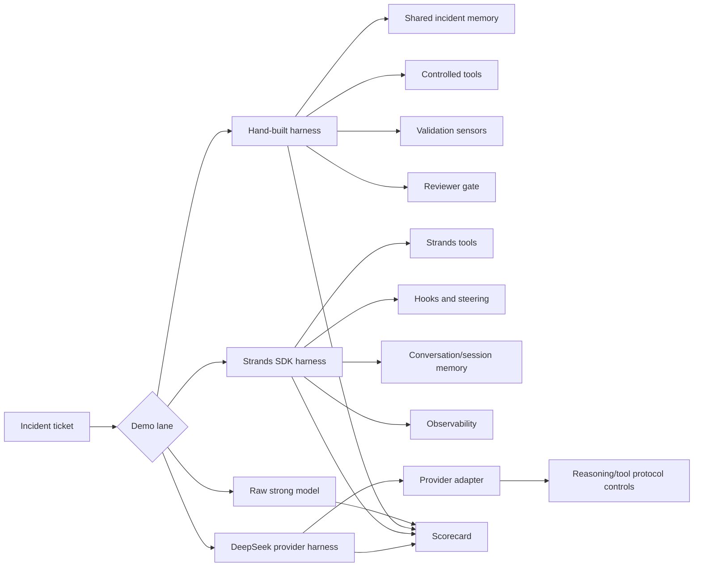

# Architecture

## Harness Components

| Component | Hand-built implementation | Strands abstraction | Provider harness abstraction |
| --- | --- | --- | --- |
| Workflow | Python runner | Agent runtime / multi-agent patterns | Provider adapter |
| Context | Explicit incident memory object | Conversation/session managers | Provider-managed context rules |
| Tools | Python functions | `@tool` and tool registry | Provider-compatible tools |
| Sensors | Custom checks | Hooks, plugins, steering | Protocol validation |
| Repair | Retry loop | Agent feedback through hooks | Provider-specific retries |
| Observability | JSON reports | OpenTelemetry hooks/integrations | CLI/probe reports |

## Why The Demo Has Four Lanes

The spectrum matters:

- Hand-built proves what the harness does.
- Strands proves the industry is abstracting the harness into SDKs.
- DeepSeek provider harness proves some controls can become plug-and-play.
- Raw model proves why model quality alone is insufficient.
